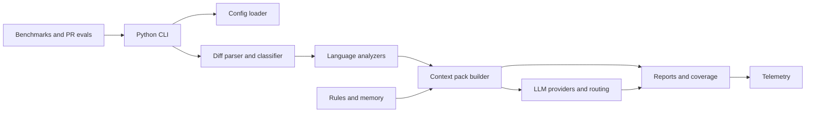
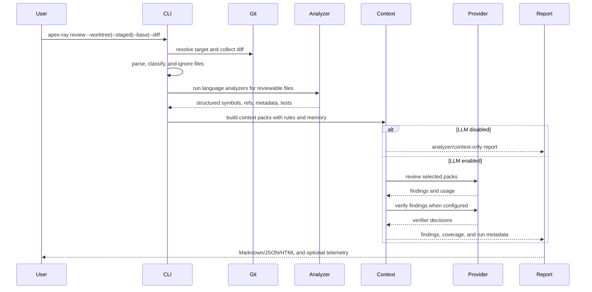
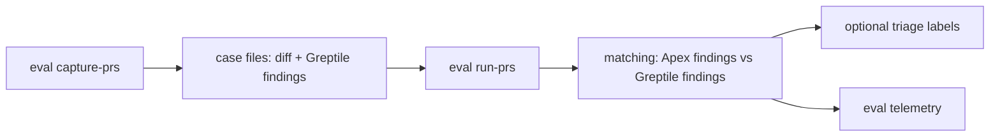

# Architecture And Workflow

This document gives a high-level map of how Apex Ray works. It focuses on product flow and implementation boundaries rather than line-by-line code details.

## What Apex Ray Is

Apex Ray is a local CLI-first review engine. It reads a git diff, builds compact TypeScript/JavaScript/Python context around changed code, optionally asks a local LLM CLI provider to review that context, verifies findings, and writes local reports and telemetry.

The core design goal is local review intelligence:

- deterministic diff, analyzer, context, report, telemetry, benchmark, and eval flows run without hosted services;
- LLM calls go through locally configured Codex CLI or Claude Code CLI providers;
- project-specific rules and memory stay in the repository when the team chooses to commit them;
- local config, provider credentials, caches, telemetry, and generated reports stay uncommitted by default.

## Main Components

### Python CLI

The `src/apex_ray/cli/` package owns the user-facing command surface:

- `review`: run local review for worktree, staged, diff file, base branch, or continuation report.
- `gate pre-push`: run the configured pre-push review gate and return a blocking exit code when policy fails.
- `init`: create project setup files.
- `doctor`: check local setup and analyzer availability.
- `memory`: lint and suggest repo memory cards.
- `benchmark`: run executable benchmark cases.
- `eval`: capture and replay historical GitHub PR review cases.
- `telemetry-summary`: summarize local review run telemetry.

The package root `apex_ray.cli` re-exports the Typer `app` for the console script.

### Review Pipeline

The `src/apex_ray/pipeline/` package owns the end-to-end review orchestration:

- parse and classify the selected diff;
- discover project metadata;
- run enabled language analyzers;
- build context packs;
- choose deep and shallow LLM review coverage;
- consolidate findings;
- continue review from partial reports.

The package root `apex_ray.pipeline` re-exports the stable pipeline API. Implementation lives in `runner.py`, `selection.py`, and `findings.py`.

### Analyzer Backends

Apex Ray runs analyzer backends independently per language family. A backend can produce symbol-aware context for its files while another backend falls back to diff-only packs or succeeds normally. Analyzer results use a shared schema: changed symbols, references, callees, contracts, metadata, related tests, warnings, partial status, and failed files.

### TypeScript/JavaScript Analyzer

The analyzer under `analyzer-runtimes/typescript/src/` is a Node/TypeScript program bundled into the Python package. It builds repository-aware context for TS/JS changes:

- changed symbols and changed line ranges;
- references, callers, callees, and related tests;
- NestJS/provider/module metadata and dependency surfaces;
- DTO, schema, decorator, enum, route, object, tuple, and synthetic symbol context;
- workspace package import/export/member references.

Python calls the analyzer as a subprocess, receives structured JSON, and falls back to diff-only context when analyzer coverage is unavailable for a file.

### Python Analyzer

The Python analyzer lives under `src/apex_ray/analyzers/python/` and runs in-process with the Python stdlib `ast` parser. It builds repository-aware context for Python changes:

- changed functions, async functions, classes, methods, assignments, and deleted symbols;
- imports, exports, references, direct callees, and related tests;
- annotation contracts, base/protocol contracts, dataclass/TypedDict/Protocol surfaces, and Pydantic/FastAPI schema boundaries;
- FastAPI route/dependency metadata, SQLAlchemy transaction/session boundaries, Alembic migration operations, external I/O adapters, worker/event publish/send boundaries, and pytest/unittest fixture context;
- syntax/read failures as analyzer warnings with diff-only fallback for affected files.

### Context Packs

Context packs are the unit of LLM review. A pack usually represents one changed symbol or file-level change and contains:

- diff snippets for changed lines;
- changed symbol snippets;
- references, callees, contracts, metadata, and related tests;
- matched project rules and memory cards;
- risk signals, file kind, estimated size, and coverage metadata.

The pack builder tries to include enough context to evaluate behavior without sending the entire repository.

### LLM Providers

LLM review is optional. Without `--llm`, Apex Ray still produces analyzer/context/report output and can run deterministic benchmark checks.

When LLM review is enabled, provider routing can choose profiles for broad review, verification, and escalation. Profiles can point to Codex CLI, Claude Code CLI, or a fake provider used by tests.

The LLM layer owns:

- prompt construction;
- provider subprocess calls;
- response parsing;
- finding validation and filtering;
- cache keys and response cache;
- model/profile/route usage metadata;
- verifier approval or rejection.

Like the other Python packages, `apex_ray.llm` is a thin public export surface. Review execution lives in `llm/review.py`, while provider subprocesses, routing, prompts, cache, response parsing, and usage accounting live in package-local modules.

### Reports And Coverage

Reports are written as Markdown, JSON, and optionally HTML. They include:

- findings with severity, confidence, evidence, suggested fix, and suggested test;
- analyzer results and warnings;
- LLM runs and routes;
- reviewed and unreviewed context packs;
- skipped reasons, provider failures, and partial coverage severity;
- continuation commands for residual packs;
- cache, token estimate, and duration metrics.

The JSON report is the durable machine-readable artifact. Markdown and HTML are for local reading.

## Review Flow

The important review decision is context selection. Apex Ray ranks packs by risk, file kind, changed lines, truncation, rules, memory, and coverage goals. Large PRs can produce partial coverage; reports expose what was reviewed, what was skipped, and how to continue with residual packs.

## Init Flow

`apex-ray init` bootstraps a repository for local review.

It creates or updates:

- `.apex-ray/config.yml`: shared project config with conservative defaults.
- `.apex-ray/.gitignore`: ignores local cache, telemetry, reports, runs, and local overrides under `.apex-ray`.
- `.apex-ray/rules/`: committed project review rules.
- `.apex-ray/memory/`: committed team learning cards.
- `.apex-ray/reports/`: ignored local report output.
- `.apex-ray/eval/`: eval support directories; run outputs are ignored.
- `lefthook.yml`: optional local hook config with an Apex Ray pre-push gate command.
- `AGENTS.md` / Claude agent files: short pointers for coding agents.
- `.apex-ray/skills/apex-ray/SKILL.md` for review workflows and `.apex-ray/skills/apex-ray-improve/SKILL.md` for post-merge learning recommendations, plus Codex/Claude skill copies when enabled.

The init command is intentionally conservative: shared config is commit-friendly, local provider/model/cost settings go into `.apex-ray/config.local.yml`, and generated outputs stay ignored.

## Pre-Push Gate Flow

`apex-ray gate pre-push` is the hook-friendly wrapper around the review pipeline. It reviews the configured base branch diff, writes the same Markdown/JSON report artifacts as normal review, evaluates `review.gates.pre_push`, prints live progress to stderr, prints a short blocking summary to stdout, and exits `1` when the gate blocks.

The gate does not narrow the diff after a failed push. It keeps reviewing `base...HEAD` for correctness and relies on the LLM response cache plus analyzer caches where available to make repeated fix-and-push attempts cheaper. When a previous pre-push JSON report exists, stdout includes a small delta for new, still blocking, and resolved blocking findings.

## Configuration Flow

Configuration is merged in this order:

1. built-in defaults;
2. committed `.apex-ray/config.yml`;
3. ignored `.apex-ray/config.local.yml`;
4. CLI flags.

This lets a team commit shared review policy while each developer keeps personal provider, model, path, cache, and cost settings locally.

## Rules And Memory

Rules and memory are small Markdown files with YAML frontmatter.

- Rules describe review constraints that should be applied when paths, symbols, risk, or triggers match a context pack.
- Memory cards capture team learning, domain invariants, false-positive calibration, and recurring review hints.

Both are selected by relevance before prompt construction so they do not automatically inflate every LLM request.

## Telemetry Flow

Telemetry is append-only JSONL and is not injected into review prompts. It is used for tuning:

- run duration;
- target mode and changed-file counts;
- LLM enabled/disabled state;
- model/provider/profile routing;
- estimated input tokens, provider-reported actual tokens when available, and estimated provider cost;
- cache hits, misses, and estimated cache-saved input tokens;
- coverage ratio and skipped packs;
- finding counts and verifier outcomes.

By default telemetry is local and ignored. Teams can opt into a shared telemetry path only when they intentionally review and commit that artifact.

## Historical PR Eval Flow

Historical PR evals are for measuring review quality against prior GitHub PR comments.

Capture stores historical diffs and first-pass Greptile findings. Replay creates temporary worktrees, runs Apex Ray on those diffs, and compares matched, missed, and extra findings. Optional labels let maintainers triage whether Greptile findings were valid and whether Apex extra findings are useful.

## Benchmark Flow

Benchmarks are executable local cases. Each YAML case points to a fixture repo and diff, then declares expected findings and/or expected context.

- Context benchmarks usually run with `llm: false` and assert that the analyzer/context pipeline includes the right references, callees, contracts, metadata, or tests.
- Fake-provider benchmarks run with `provider: fake` to test LLM report plumbing deterministically.
- Codex benchmark cases run with `provider: codex_cli` and are intended for manual or explicit LLM-backed quality checks, not ordinary fast unit tests.

Benchmark reports can be compared to detect regressions in expected findings, expected context, prompt versions, token estimates, cache behavior, and duration.

## Test Fixtures And Benchmarks

`tests/fixtures/` contains source material used by tests:

- `sample.diff`: a small patch used by diff parsing, classification, and CLI output tests.
- `ts_project/`: a tiny TypeScript project with `src/`, `tests/`, `tsconfig.json`, and several diffs. It exercises the core analyzer/context/review path.
- `ts_quality/*/`: synthetic TS/JS repositories with one `repo/` directory and one `change.diff`. Each fixture targets a specific context or review-quality behavior: references, workspace imports, NestJS metadata, schema contracts, route entries, permission changes, cache leaks, related tests, and similar cases.
- `python_quality/*/`: synthetic Python repositories with one `repo/` directory and one `change.diff`. These cases exercise Python analyzer/context behavior such as importing consumers, callees, protocol/base contracts, FastAPI route metadata, Pydantic schema contracts, SQLAlchemy transaction boundaries, Alembic migrations, external I/O adapters, worker/event metadata, pytest fixture overrides, and related tests.

`tests/benchmarks/` contains YAML wrappers around those fixtures:

- top-level `*_context.yml` cases are deterministic context benchmarks used by `tests/test_benchmark.py`;
- `cart_bug_fake.yml` uses the fake provider to test LLM finding and verifier plumbing without external calls;
- `codex/*.yml` cases are LLM-backed quality benchmark definitions for explicit Codex CLI runs.

The pattern is:

1. a fixture repo models the codebase state;
2. `change.diff` models the review diff;
3. a benchmark YAML points at both;
4. expected context/finding blocks define the regression contract;
5. tests or explicit benchmark runs execute the case and fail when expected context or findings disappear.

## Production Boundaries

Apex Ray intentionally does not replace:

- project tests;
- linters and typecheck;
- dependency scanners;
- SAST/secret scanners;
- human review.

It is a local review layer that tries to improve behavioral review quality and make partial coverage explicit.
